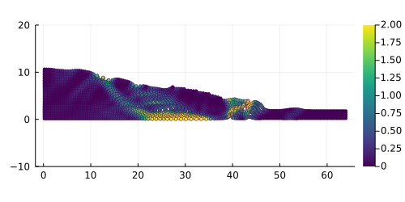

# ***ϵp2DeJu*** #
## **Description** 
This is a small Julia project of an implementation of the solver [ep2-3De v1.0](https://github.com/ewyser/ep2-3De) (written in C and CUDA C) in the Julia language. It solves explicit elasto-plastic problems within a finite deformation framework, *i.e.,* logarithmic strains and kirchoff stresses, using the **material point method** with **cubic b-spline shape functions** (*i.e.,* instead of gimp formulation within ``ep2-3De v1.0``).

<p align="center">
  
</p>

* **Fig |** Slumping dynamics (withou any volumetric locking corrections) showing the accumulated plastic strain $\epsilon_p^{\mathrm{acc}}$ after an elastic load of 8 s and an additional elasto-plastic load of $\approx$ 7 s. 

The solver relies on random gaussian fields to generate initial fields $\psi(\boldsymbol{x})$, *e.g.,* the cohesion $c(\boldsymbol{x}_p)$ or the internal friction angle $\phi(\boldsymbol{x}_p)$, with the material point's coordinates $\boldsymbol{x}_p$. 

<p align="center">
  
</p>

* **Fig |** Initial cohesion field $c_0(\boldsymbol{x}_p)$ with average $\mu=20$ kPa with a variance $\sigma\pm5$ kPa.

## **Content**
1. [Usage](#id-section2)
<div id='id-section2'/> 

## **Usage**

### Structure of the project
<details> <summary>Show tree organisation</summary>

  ```terminal
  ├── Manifest.toml
  ├── Project.toml
  ├── README.md
  ├── docs
  ├── scripts
  ├── src
  └── start_macOS.sh
  ```
</details> 

The general structure is simple. The ```./scripts``` folder contains the following routines:
-  ```sim.jl``` 
-  ```splineCheck.jl```  

The ```./src``` folder contains all functions needed and are called by the different routines in ```./scripts```. The ```./docs/out``` folder contains all the plots and data generated by the solver during computation. If needed, modifications can be made to these routines by changing initial parameters and/or algorithm blocks. 

### ``101`` - How to ```ϵp2De()```  

0. (opt.) Get Julia [here](https://julialang.org/downloads/) and follow instructions for installation
1. ``cd`` to the local repo ```./ep2DeJu ``` 
2. Launch Julia (on macOS, drag & drop ```start_macOS.sh``` in the terminal)
```julia
% julia --project  
               _
   _       _ _(_)_     |  Documentation: https://docs.julialang.org
  (_)     | (_) (_)    |
   _ _   _| |_  __ _   |  Type "?" for help, "]?" for Pkg help.
  | | | | | | |/ _` |  |
  | | |_| | | | (_| |  |  Version 1.6.5 (2021-12-19)
 _/ |\__'_|_|_|\__'_|  |  Official https://julialang.org/ release
|__/                   |
```
3. Enter pkg mode ``` ] ```, then ``activate .`` the project ``ep2DeJu`` and ``instantiate`` its environment and related packages. You can ``st`` to check package status.
```julia
(ep2DeJu) pkg> activate .
(ep2DeJu) pkg> instantiate 
(ep2DeJu) pkg> st
Project ep2DeJu v0.1.0
Status `./ep2DeJu/Project.toml`
  [6e4b80f9] BenchmarkTools v1.3.2
  [b964fa9f] LaTeXStrings v1.3.0
  [91a5bcdd] Plots v1.39.0
  [92933f4c] ProgressMeter v1.9.0
  [37e2e46d] LinearAlgebra
  [44cfe95a] Pkg v1.8.0

(ep2DeJu) pkg>
```
4. Compile using ``include()`` and run method ``ϵp2De(nel,varPlot,cmType; kwargs...)``. It should result in the following:
```julia
julia> include("./scripts/sim.jl")
ϵp2De (generic function with 1 method)
julia> ϵp2De(40,"P","MC")
[ Info: ** ϵp2-3De v0.1.0: finite strain formulation **
┌ Info: mesh & mp feature(s):
│   nel = 528
│   nno = 585
└   nmp = 591
[ Info: launch bsmpm calculation cycle...
✓ working hard:          Time: 0:00:09 (22.83 ms/it)
  nel,np:        (528, 591)
  iteration(s):  432
  ηmax,ηtot:     (21, 849)
  (✓) t/T:       100.0
┌ Info: Figs saved in
└   path_plot = "./docs/out/"
│
└ (✓) Done! exiting...
julia>
```
5. Input parameters: ``nel`` is the number of elements along the $x$ dim., ``varPlot`` (``"P"`` for pressure, ``"du"`` for displacement or ``"epII"`` for plastic strain) is an option for selecting field for plot, ``cmType`` defines the constitutive model being used. 

6. Optional ``kwargs`` are: ``shpfun="bsmpm"`` defining shapefunctions (currently ``"bsmpm"`` or ``"gimpm"``), ``fwrk="finite"`` defining the deformation framework and ``vollock=true`` is a boolean (*e.g.,* ``true``/``false``) controlling volumetric locking corrections using $\Delta\bar{F}$ (see [1,2]). An example with ``kwargs`` is given below
```julia
ϵp2De(40,"P","MC";shpfun="bsmpm",fwrk="finite",vollock=true)
```

5. Outputs (figs, gif, etc.) are saved in the folder ```./docs/out/ ```

## **References**
For useful references, the reader can have a look in the folder ```./docs/refs```, where some of the following references can be found

1. Xie M, Navas P, López-Querol S. An implicit locking-free B-spline Material Point
Method for large strain geotechnical modelling. Int J Numer Anal Methods Geomech. 2023;1-21.
https://doi.org/10.1002/nag.3599

2. Zhao Y, Jiang C, Choo J. Circumventing volumetric locking in explicit material point
methods: A simple, efficient, and general approach. Int J Numer Methods Eng. 2023;1-22. https://doi.org/10.1002/nme.7347