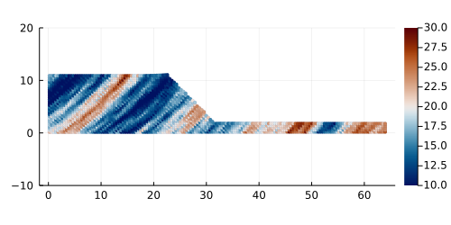

# ***ep2DeJu*** #
## **Description** 
This is a small Julia project and an implementation of the solver [ep2-3De v1.0](https://github.com/ewyser/ep2-3De) (written in C and CUDA C) in the Julia language. The routine solves explicit elasto-plastic problems within a finite deformation framework, i.e., logarithmic strains and kirchoff stresses, using the material point method with cubic B-Spline shape functions (instead of GIMP formulation in the original ep2-3De v1.0).

<p align="center">
  
</p>

* **Fig |** Slumping dynamics showing the accumulated plastic strain $\epsilon_p$ after an elastic load of 8 s and an additional elasto-plastic load of $\approx$ 7 s. 

The solver also uses random gaussian fields to generate initial fields, such as the cohesion field or the internal friction angle, which are taken as spatial variables instead of constant parameters. 

<p align="center">
  
</p>

* **Fig |** Initial cohesion field with average $\mu=20$ kPa with a variance $\sigma=5$ kPa. This corresponds to the initial condition for the result showed above. 

## **Content**
1. [Usage](#id-section2)
<div id='id-section2'/> 

## **Usage**

### Structure of the project
The general structure is given below:
```terminal
.
├── Manifest.toml
├── Project.toml
├── README.md
├── out
├── scripts
├── src
└── start_macOS.sh
```

The ```./scripts``` folder contains the following routines:
-  ```Nsim.jl``` 
-  ```sim.jl``` 
-  ```splineCheck.jl```
-  ```viz.jl```  

The ```./src``` folder contains all functions needed and are called by the different routines in ```./scripts```.

The ```./out``` folder contains all the plots and data generated by the solver during computation

If needed, modifications can be made to these routines by changing initial parameters and so on. 

### Run the routine ```sim.jl``` 

0. (opt.) Get Julia [here](https://julialang.org/downloads/) and follow instructions
1. Navigate to the local repo ``` ./ep2DeJu ``` 
2. Launch Julia (on macOS, drag & drop ```start_macOS.sh``` in the terminal without navigating in terminal)
```julia
% julia --project  
               _
   _       _ _(_)_     |  Documentation: https://docs.julialang.org
  (_)     | (_) (_)    |
   _ _   _| |_  __ _   |  Type "?" for help, "]?" for Pkg help.
  | | | | | | |/ _` |  |
  | | |_| | | | (_| |  |  Version 1.6.5 (2021-12-19)
 _/ |\__'_|_|_|\__'_|  |  Official https://julialang.org/ release
|__/                   |

```

3. Enter pkg mode ``` ] ``` and instantiate the environment
```julia
(saintVenant) pkg> activate .
(saintVenant) pkg> instantiate 
(saintVenant) pkg> st
```
4. Run a script
```julia
julia> include("./scripts/sim.jl")
```

5. The outputs (figs, gif, etc.) are saved in the folder ``` ./src/out/ ```